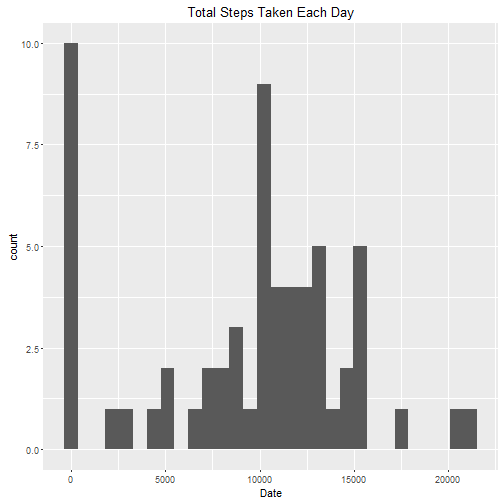
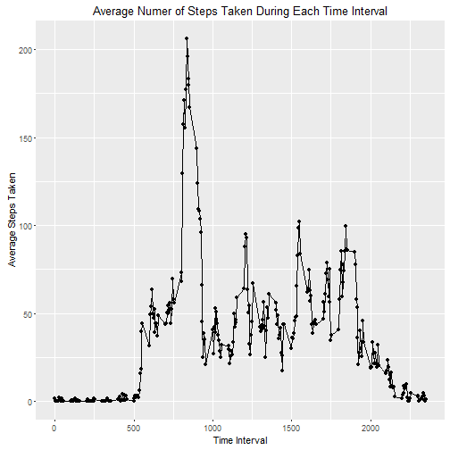
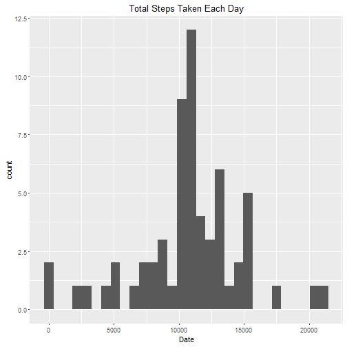
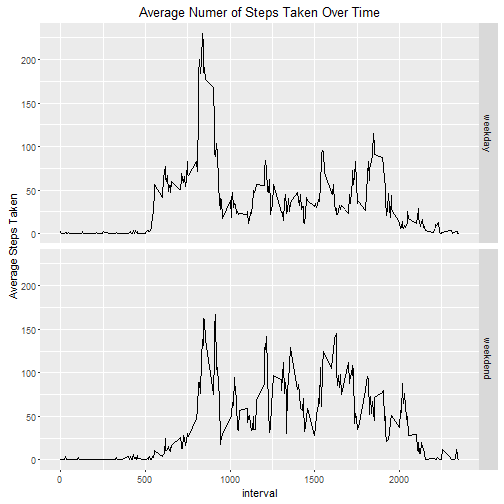

Make sure your working directory is set to the cloned repo.  We now read in the data and reformat it where necessary.


```r
library(dplyr)
```

```
## 
## Attaching package: 'dplyr'
```

```
## The following objects are masked from 'package:stats':
## 
##     filter, lag
```

```
## The following objects are masked from 'package:base':
## 
##     intersect, setdiff, setequal, union
```

```r
library(ggplot2)
library(lubridate)

# read data, coerce date to date format and steps to numeric
activity <- read.csv("./activity/activity.csv")
activity <- activity %>%
      mutate(date = ymd(date)) %>%
      mutate(steps = as.numeric(steps))
```

# What is mean total number of steps taken per day?
### 1. Calculate total steps taken each day

```r
df1 <- activity %>%
      group_by(date) %>%
      summarize(totalDaySteps = sum(na.omit(steps)))
print(head(df1))
```

```
## Source: local data frame [6 x 2]
## 
##         date totalDaySteps
##       (time)         (dbl)
## 1 2012-10-01             0
## 2 2012-10-02           126
## 3 2012-10-03         11352
## 4 2012-10-04         12116
## 5 2012-10-05         13294
## 6 2012-10-06         15420
```

### 2. Make histogram of total steps each day

```r
p1 <- qplot(df1$totalDaySteps, main = "Total Steps Taken Each Day") + 
      labs(xlab("Date"), y = "Total Steps") 
print(p1)
```

```
## `stat_bin()` using `bins = 30`. Pick better value with `binwidth`.
```



### 3. Calculate mean and median of total steps each day

```r
meanSteps <- mean(df1$totalDaySteps, na.rm = T)
medianSteps <- median(df1$totalDaySteps, na.rm = T)
print(meanSteps)
```

```
## [1] 9354.23
```

```r
print(medianSteps)
```

```
## [1] 10395
```


# What is the average daily activity pattern?

### 1. Make time series plot of 5-minute interval and average steps

```r
df2 <- activity %>% 
      group_by(interval) %>%
      summarise(avgSteps = mean(steps, na.rm = T))
p2 <- with(df2, qplot(interval, avgSteps, main = "Average Numer of Steps Taken During Each Time Interval") + 
                 labs(xlab("Time Interval")) +
                 labs(ylab("Average Steps Taken")) +
                 geom_line())
print(p2)
```


      
### 2. Which 5-minute interval contains the max number of steps?

```r
ind <- which.max(df2$avgSteps)
print(ind)
```

```
## [1] 104
```


# Input missing values

### 1. Calculate and report the total number of missing values in the dataset (i.e. the total number of rows with NAs)

```r
a <- na.omit(activity)
ans <- nrow(activity) - nrow(a)
print(ans)
```

```
## [1] 2304
```

### 2. Devise strategy for replacing missing valuee.
Our strategy is to replace each NA by its interval mean as mentioned in the directions.

### 3. Create new data set with missing values filled in
We find the interval averages and replace the NAs in step by their respective interval averages.

```r
df3 <- activity %>%
      group_by(interval) %>%
      mutate(intervalAvg = mean(steps, na.rm = T)) 
df3$steps[is.na(df3$steps)] <- df3$intervalAvg[is.na(df3$steps)]
df3 <- select(df3, -intervalAvg)
```

### 4. Make histogram of total steps taken each day

```r
df4 <- df3 %>%
      group_by(date) %>%
      summarize(totalDaySteps = sum(na.omit(steps)))
p3 <- qplot(df4$totalDaySteps, main = "Total Steps Taken Each Day") + 
      labs(xlab("Date"), y = "Total Steps") 
print(p3)
```

```
## `stat_bin()` using `bins = 30`. Pick better value with `binwidth`.
```



Now we report mean and median as required.
#### How are they different from those obtained earlier (removed NAs)?

```r
newMeanSteps <- mean(df4$totalDaySteps, na.rm = T)
newMedianSteps <- median(df4$totalDaySteps, na.rm = T)
print(newMeanSteps) # the mean steps increased
```

```
## [1] 10766.19
```

```r
print(newMedianSteps) # the median steps increased
```

```
## [1] 10766.19
```

Both the mean and median increased as a result of substituting the missing values with their respective interval means.

# Are there differences in activity patterns between weekdays and weekends?

### 1. Create new factor variable in df3: call it day

```r
df5 <- df3 %>%
      mutate(day = weekdays(date)) %>%
      mutate(day = gsub("Monday", "weekday", day)) %>%
      mutate(day = gsub("Tuesday", "weekday", day)) %>%
      mutate(day = gsub("Wednesday", "weekday", day)) %>%
      mutate(day = gsub("Thursday", "weekday", day)) %>%
      mutate(day = gsub("Friday", "weekday", day)) %>%
      mutate(day = gsub("Saturday", "weekdend", day)) %>%
      mutate(day = gsub("Sunday", "weekdend", day)) %>%
      mutate(day = factor(day)) %>%
      group_by(interval) %>%
      group_by(day, add = T) %>%
      mutate(intervalAvg = mean(steps))
```

### 2. Make panel plot

```r
p4 <- ggplot(df5, aes(interval, intervalAvg)) + 
      geom_line() + 
      facet_grid(day ~ .) +
      labs(ylab("Average Steps Taken"), xlab("Time Interval")) + 
      ggtitle("Average Numer of Steps Taken Over Time")
print(p4)
```




